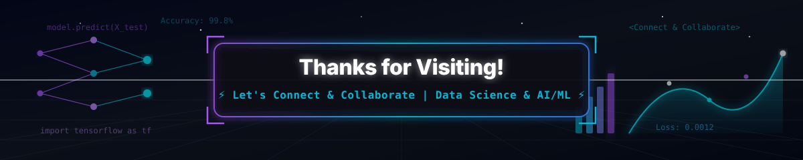

# 
⚡ Subhankar Giri | Data Science & AI/ML ⚡

  

  

  <b style="color: #00f0ff;">✨ Data Science | Data Analytics | Machine Learning | Python | SQL | Power BI ✨</b>

  
  
  
  
  
  

---

### 🚀 About Me & Introduction

A passionate **Data Scientist & Analyst** with a strong focus on **AI/ML Systems** & Data Engineering. Currently pursuing my B.Tech in Computer Science & Engineering, I specialize in transforming raw, unstructured datasets into predictive models and actionable business insights.

- 🎓 **Education**: B.Tech in Computer Science & Engineering *(In Progress)*
- 💼 **Experience**: Data Science Intern
- 🔭 **Focus Areas**: Advanced Predictive Analytics, Machine Learning Optimization, BI Dashboarding

---

### 🌱 Currently Learning & Exploring

- 🧠 **Deep Learning**: Neural Networks, CNNs, LSTMs, Transformers
- 🗣️ **Natural Language Processing (NLP)**: Text Embeddings, LLM Finetuning
- ⚡ **Generative AI**: GANs, Diffusion Models, Prompt Engineering
- 🚀 **Apache Spark**: Distributed Big Data Analytics & Pipelines

---

### 🛠️ My Tech Stack & Toolkit

<table align="center">
  <tr>
    <td align="center" width="50%" valign="top">
      <b style="color: #00f0ff;">⚡ Languages & Databases ⚡</b>
        
      
      
      
      
      
      
      
    </td>
    <td align="center" width="50%" valign="top">
      <b style="color: #ff007f;">🤖 Data Science & AI/ML 🤖</b>
        
      
      
      
      
      
      
      
      
    </td>
  </tr>
  <tr>
    <td align="center" width="50%" valign="top">
      <b style="color: #9d4edd;">📊 Visualization & Analytics 📊</b>
        
      
      
      
      
    </td>
    <td align="center" width="50%" valign="top">
      <b style="color: #39ff14;">🛠️ Tools & Environments 🛠️</b>
        
      
      
      
      
      
    </td>
  </tr>
</table>

---

### 💻 Highlighted Projects

  

  
<b>📌 Thiranex Data Science Unified Portal & Retail AI Engine</b>

   

  - 📝 **Description**: An interactive 4-in-1 full-stack Data Science web application covering automated data cleaning, predictive ML modeling, statistical workforce EDA, and an enterprise customer churn AI simulator with financial ROI optimization.
  - 🛠️ **Tech Stack**: 
    
    
    
    
    
    

  

    
    
    
  

---

### 🏆 Coding Achievements

  
  
  
  

---

### 🎓 Certifications

  
  
  
  

- 📜 **IBM Data Science Specialization**
- 📜 **Google Data Analytics Professional Certificate**
- 📜 **Microsoft Power BI Desktop Complete**
- 📜 **Cisco Networking Basics**

---

### 📊 GitHub Overview & Activity

  

<table align="center">
  <tr>
    <td align="center" width="50%">
      
    </td>
    <td align="center" width="50%">
      
    </td>
  </tr>
</table>

  

  

---

### 🐍 Contribution Grid Snake (Multi-Color Neon 3D Style)

  
  
  
  
  
  

  

---

### 📬 Connect With Me

  
  
  
  
  
  
  

---

  <i>"Without data, you're just another person with an opinion." — W. Edwards Deming</i>

